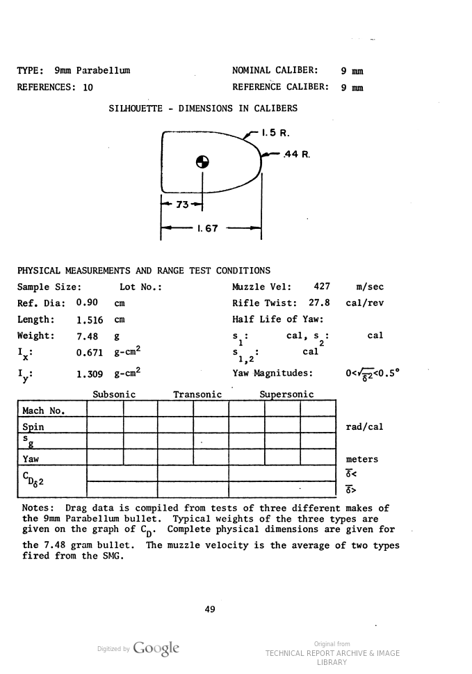

# Queda de Velocidade de um Projétil 9 mm Através de Vidro

Um estudo interessante sobre a penetração de projéteis de 9 mm mostra como a velocidade do projétil diminui à medida que ele atravessa múltiplas camadas de vidro. Cada camada de vidro tem aproximadamente 1/8 de polegada de espessura, o que é equivalente a cerca de 3,175 mm.

## Velocidades Observadas

A tabela a seguir resume a velocidade do projétil após passar por 0 a 6 camadas de vidro:

| Glasses | Velocity MPH | Velocity m/s |
|---------|--------------|--------------|
| 0       | 806          | 360.31       |
| 1       | 690          | 308.46       |
| 2       | 590          | 263.75       |
| 3       | 375          | 167.64       |
| 4       | 163          | 72.87        |
| 5       | 120          | 53.64        |
| 6       | 50           | 22.35        |

## Análise da Relação Física

A relação entre a quantidade de camadas de vidro e a queda de velocidade do projétil sugere uma progressão não linear, indicando que cada camada adicional de vidro tem um impacto crescente na desaceleração do projétil. Isso pode ser explicado pelo aumento da resistência ao movimento que o projétil enfrenta, além do possível acúmulo de danos no próprio projétil que pode alterar sua aerodinâmica e capacidade de penetração.

Para mais detalhes sobre o experimento e observações visuais, consulte o vídeo em [https://www.youtube.com/watch?v=PD1vkhFO4Dg](https://www.youtube.com/watch?v=PD1vkhFO4Dg).

