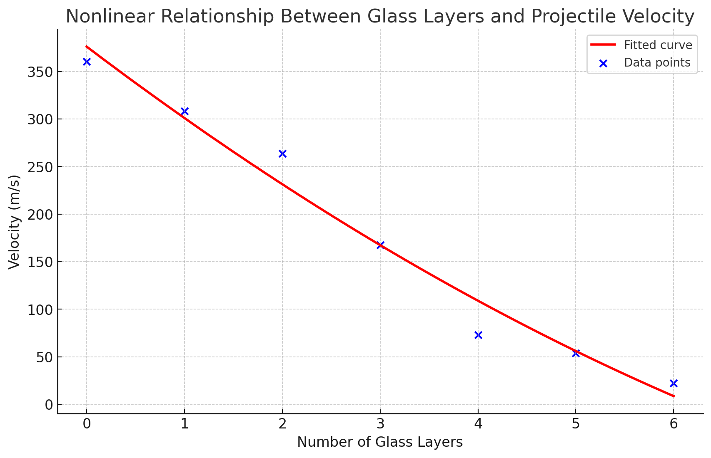

# Queda de Velocidade de um Projétil 9 mm Através de Vidro

Um estudo interessante sobre a penetração de projéteis de 9 mm mostra como a velocidade do projétil diminui à medida que ele atravessa múltiplas camadas de vidro. Cada camada de vidro tem aproximadamente 1/8 de polegada de espessura, o que é equivalente a cerca de 3,175 mm.

## Velocidades Observadas

A tabela a seguir resume a velocidade do projétil após passar por 0 a 6 camadas de vidro:

| Glasses | Velocity MPH | Velocity m/s |
|---------|--------------|--------------|
| 0       | 806          | 360.31       |
| 1       | 690          | 308.46       |
| 2       | 590          | 263.75       |
| 3       | 375          | 167.64       |
| 4       | 163          | 72.87        |
| 5       | 120          | 53.64        |
| 6       | 50           | 22.35        |

# Análise da Relação Entre Velocidade de Projéteis e Penetração em Camadas de Vidro

Neste estudo, exploramos como a velocidade de um projétil de 9 mm é afetada ao passar por múltiplas camadas de vidro de 1/8 de polegada (aproximadamente 3,175 mm de espessura). Foram utilizadas duas abordagens de modelagem para estabelecer relações que descrevem o comportamento da velocidade do projétil.

## Primeira Relação: Modelo Polinomial

Utilizamos uma função polinomial quadrática para modelar a relação não linear entre o número de camadas de vidro e a velocidade do projétil.

### Método
O código a seguir foi utilizado para ajustar uma curva aos dados fornecidos e encontrar os coeficientes da função polinomial:

```python
import numpy as np
from scipy.optimize import curve_fit
import matplotlib.pyplot as plt

layers = np.array([0, 1, 2, 3, 4, 5, 6])
velocities_mps = np.array([360.31, 308.46, 263.75, 167.64, 72.87, 53.64, 22.35])

def poly_relation(x, a, b, c):
    return a*x**2 + b*x + c

popt, pcov = curve_fit(poly_relation, layers, velocities_mps)
```

Ajustamos os dados a uma função do tipo \( v = ax^2 + bx + c \), onde \( v \) é a velocidade do projétil e \( x \) é o número de camadas de vidro. Os coeficientes encontrados foram \( a = 2.77 \), \( b = -77.86 \), e \( c = 375.98 \).



### Observações

1. O coeficiente \( c \) representa a velocidade inicial do projétil sem nenhuma barreira de vidro. Valores menores de \( c \) poderiam ser usados para representar projéteis de menor velocidade.

## Conclusão

As análises demonstram que a relação entre a velocidade do projétil e o número de camadas de vidro atravessadas é complexa e pode ser descrita por meio de funções polinomiais ou lineares, dependendo do aspecto da penetração que está sendo investigado.


Para mais detalhes sobre o experimento e observações visuais, consulte o vídeo em [https://www.youtube.com/watch?v=PD1vkhFO4Dg](https://www.youtube.com/watch?v=PD1vkhFO4Dg).


